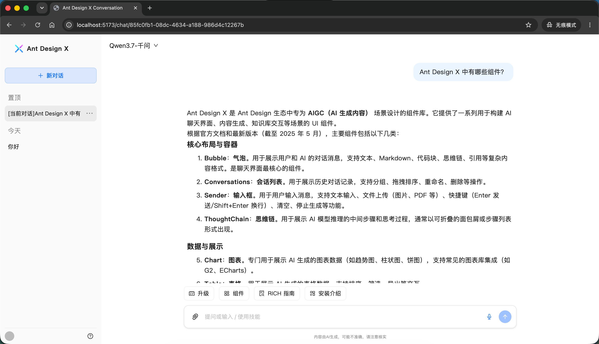
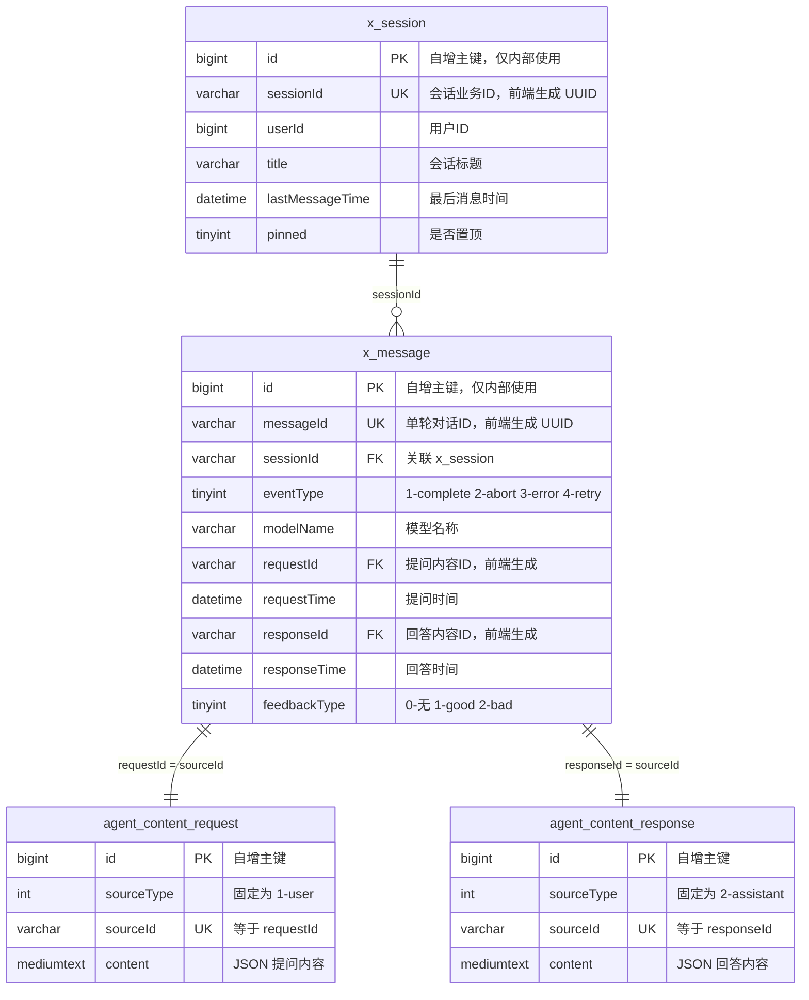

# ant-design-x-session-fullstack

基于 [Ant Design X](https://x.ant.design/) 的全栈会话示例，演示如何用 MySQL 设计并实现会话管理、消息持久化与流式对话。

**AI 代码生成**：可直接复制 [PROMPT.md](./PROMPT.md) 中的提示词给 AI，用于生成完整全栈项目。

**如何运行本项目**： [DEVELOPMENT.md](./DEVELOPMENT.md)。

理论上，只要你掌握了大的框架，后面堆叠功能基本靠vibe coding就可以了。

---

## 为什么做这个项目

Ant Design X 提供了优秀的 AI 对话 UI 组件，但**会话怎么存、消息怎么建模、流式结果怎么落库**，官方组件之外仍需要一套清晰的后端设计。

本项目开源一套可运行的全栈实践，重点分享：

- 如何设计 **会话（Session）** 与 **消息（Message）** 的数据模型
- 如何将 **消息内容与消息元数据分离**，支持流式生成、重新生成、反馈等扩展
- 为什么 AI 对话的数据模型，和传统 IM Chat **本质不同**
- **所有业务 ID 由前端生成**，后端只负责接收与持久化

---

## 核心设计理念：一问一答，而非传统 Chat

### 传统 Chat vs AI 对话

| 维度     | 传统 IM Chat                             | AI 对话（本项目）                                      |
| -------- | ---------------------------------------- | ------------------------------------------------------ |
| 消息粒度 | 每条消息独立（user / bot 各一条 record） | **一轮对话 = 一条 `x_message`（一问一答）**            |
| 内容结构 | 通常单字段文本                           | 提问、回答**分离存储**，通过 ID 关联                   |
| 生成状态 | 发送即完成                               | 存在 **streaming → complete / abort / error** 生命周期 |
| 用户操作 | 撤回、编辑单条                           | 重新生成、反馈、停止生成等围绕「整轮对话」             |
| ID 生成  | 常见为后端生成                           | **前端生成 UUID，后端原样存储**                        |

传统 Chat 里，用户发一条、Bot 回一条，往往是两条独立 message record。

而在 AI 场景下，**用户的一次提问 + 模型的一次回答，构成一个完整的「轮次（Turn）」**。这个轮次才是业务上最小的原子单元——用户反馈、重新生成、停止生成，都是针对「这一轮」，而不是某一条孤立消息。


**响应示例：**

```json
{
  "success": true,
  "data": {
    "page": {},
    "list": [
      {
        "sessionId": "e5f6g7h8-...",
        "messageId": "a1b2c3d4-...",
        "eventType": 1,
        "modelName": "deepseek-v4-flash",
        "requestMessages": [{ "type": "text/plain", "text": "你好" }],
        "responseMessages": [
          { "type": "text/plain", "text": "你好！有什么可以帮你的？" }
        ],
        "requestTime": "2026-06-23T10:00:00",
        "responseTime": "2026-06-23T10:00:03",
        "feedbackType": null
      },
      {
        ...
        "requestMessages": [...],
        "responseMessages": [...]
      },
      ...
    ]
  }
}
```

后端查询时：`x_message` 按 `sessionId` 分页/排序，再分别用 `requestId`、`responseId` 关联 `agent_content.sourceId`，将 `content.messages` 反序列化为 `requestMessages` / `responseMessages` 填入同一对象返回。

这与 Ant Design X 的前端交互模型天然契合：**数组中每个 `MessageTurn` = 一个 Bubble 组 = 一轮 Q&A**。

---

## ID 生成策略：前端生成，后端直存

本项目中，**所有 36 位 UUID 业务 ID 均由前端生成并在请求时提交，后端不做任何 ID 生成，接收到后直接写入数据库。**

| 字段         | 所属表                        | 生成方   | 说明                              |
| ------------ | ----------------------------- | -------- | --------------------------------- |
| `sessionId`  | `x_session`                   | **前端** | 新建会话时生成，后续请求携带      |
| `messageId`  | `x_message`                   | **前端** | 每轮对话的唯一 ID，重新生成时复用 |
| `requestId`  | `x_message` → `agent_content` | **前端** | 用户提问内容的 ID                 |
| `responseId` | `x_message` → `agent_content` | **前端** | AI 回答内容的 ID                  |

**为什么这样设计？**

1. **乐观 UI**：前端在用户点击发送时即可生成全部 ID，立即渲染 Bubble，无需等待后端回包
2. **流式请求幂等**：SSE 请求携带确定的 `messageId`，停止、重试、落库均可精确定位同一轮对话
3. **重新生成简单**：复用同一组 `messageId` / `requestId` / `responseId`，后端校验通过后更新内容即可
4. **职责清晰**：后端专注持久化与业务校验，不参与 ID 分配，也使得业务 ID 不可猜测

**前端生成示例：**

```typescript
import { v4 as uuidv4 } from "uuid";

// 新建会话或当前路由会话id
const sessionId = uuidv4() || sessionId;

// 用户发起一轮对话
const messageId = uuidv4() || messageId;
const requestId = uuidv4() || requestId;
const responseId = uuidv4() || responseId;

// 提交给后端，后端原样存储或校验数据库
await fetch("/api/chat", {
  method: "POST",
  body: JSON.stringify({
    sessionId,
    messageId,
    requestId,
    responseId,
    requestMessages: [{ content: "你好", mimeType: "text/plain" }],
  }),
});
```

---

## 数据模型总览

### 表关系图



> `agent_content_request` 与 `agent_content_response` 为逻辑拆分示意，物理上为同一张 `agent_content` 表，通过 `sourceType` 区分用户提问（1）与 AI 回答（2）。

### 关系说明

| 关系                                  | 类型      | 关联字段                  | 说明                         |
| ------------------------------------- | --------- | ------------------------- | ---------------------------- |
| `x_session` → `x_message`             | **1 : N** | `sessionId`               | 一个会话包含多轮对话         |
| `x_message` → `agent_content`（提问） | **1 : 1** | `requestId` = `sourceId`  | 每轮对话对应一条用户提问内容 |
| `x_message` → `agent_content`（回答） | **1 : 1** | `responseId` = `sourceId` | 每轮对话对应一条 AI 回答内容 |

### 结构示意

```
x_session (会话)
    │
    │ 1 : N   sessionId
    ▼
x_message (单轮对话 = 一问一答)
    │
    ├── requestId  ──→  agent_content (sourceType=1, user)
    └── responseId ──→  agent_content (sourceType=2, assistant)
```

> 图中所有 UUID 业务 ID 均由**前端生成**，后端只做关联存储。

## 一次完整对话的数据流

```
前端生成 ID
    sessionId / messageId / requestId / responseId
    │
    ▼
用户发送提问
    │
    ├─ 1. 创建 / 更新 x_session（sessionId 由前端传入，直接存储）
    ├─ 2. 写入 agent_content（sourceId = requestId，前端传入）
    ├─ 3. 创建 x_message（messageId 等均由前端传入，直接存储）
    │
    ▼
SSE 流式生成
    │
    ├─ token 缓冲（Redis / 内存）
    │
    ▼
生成结束 / 用户停止 / 出错
    │
    ├─ 4. 写入 agent_content（sourceId = responseId，前端传入）
    └─ 5. 更新 x_message.eventType → complete / abort / error
```
